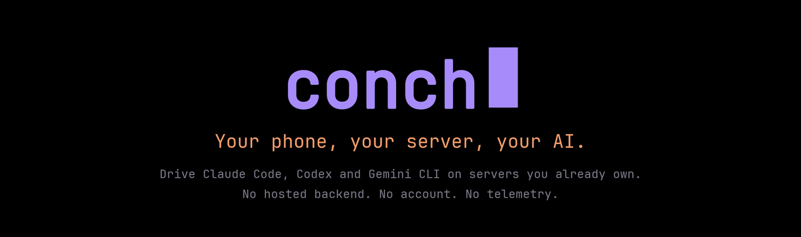
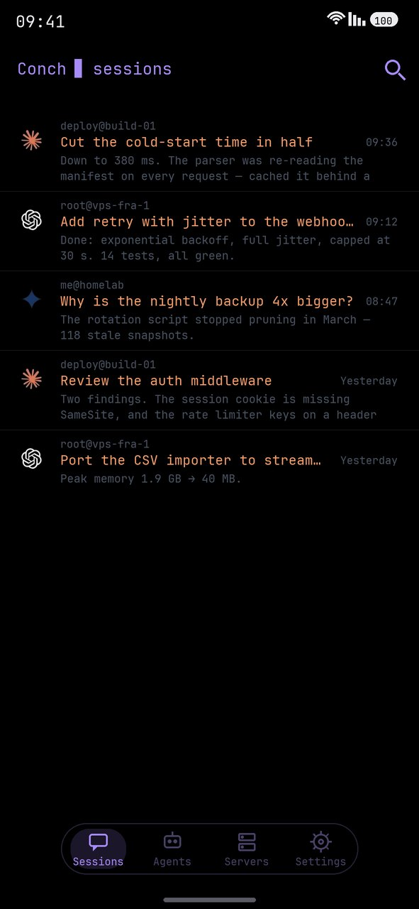
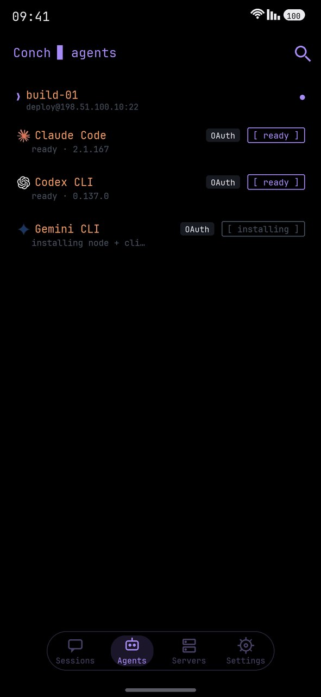
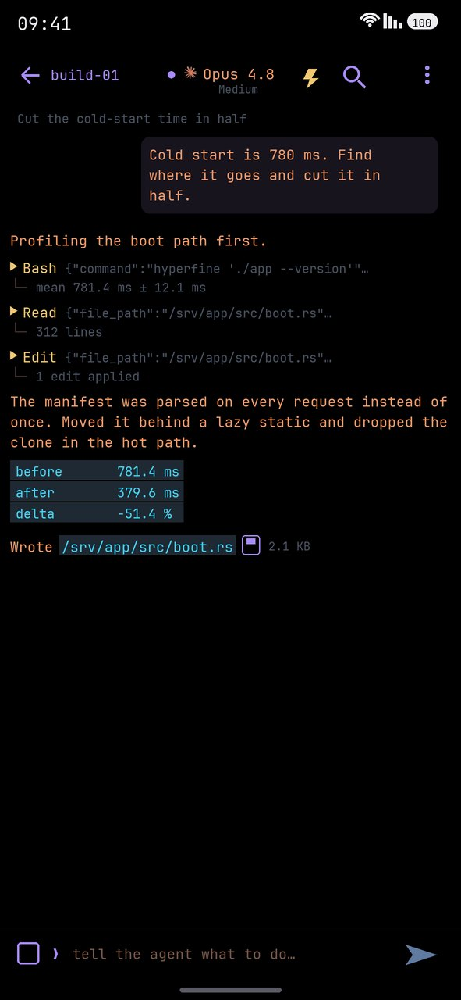
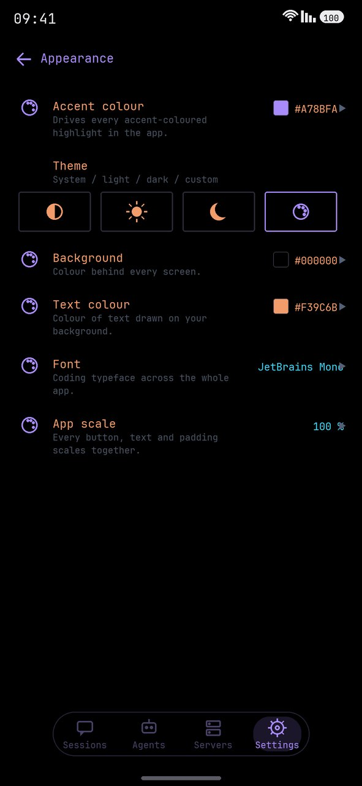
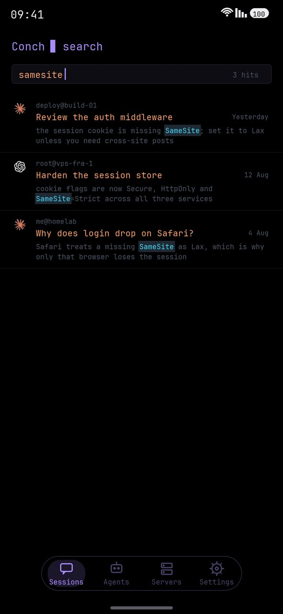
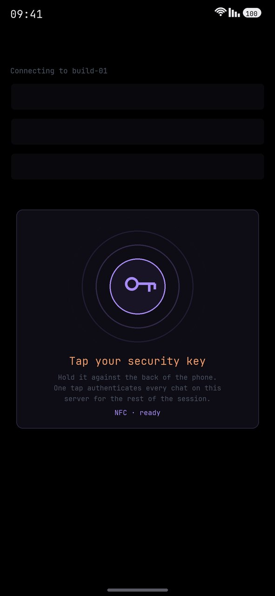
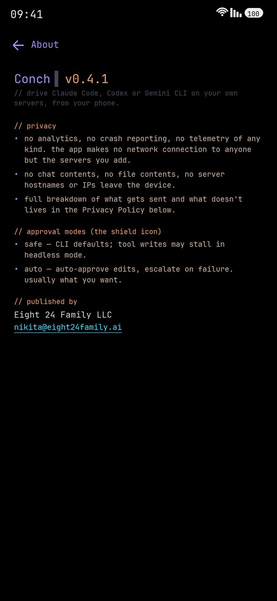
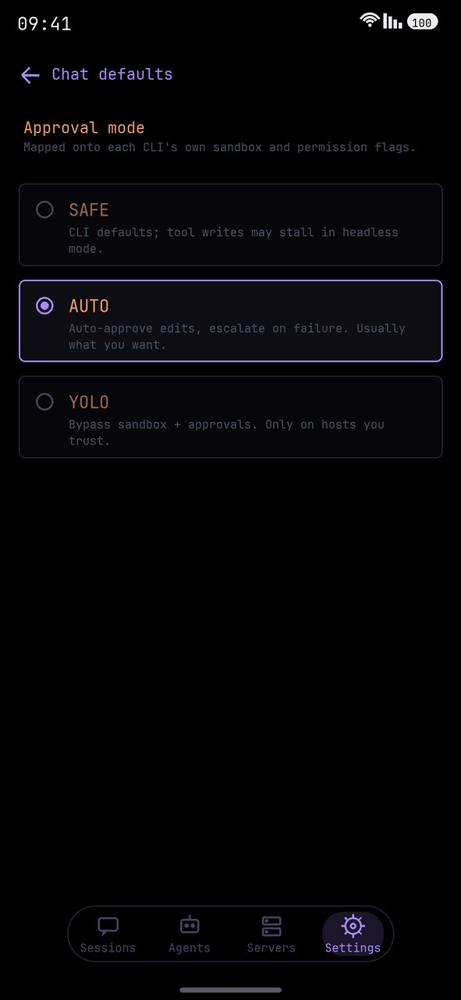
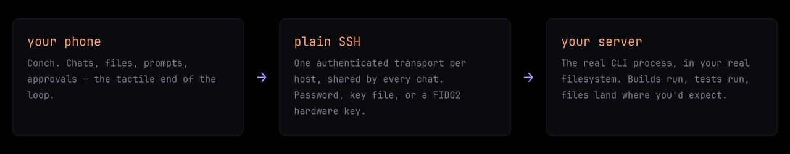

<p align="center">
  
</p>

<p align="center">
  <a href="https://github.com/nikitaeight24family/Conch/actions/workflows/test.yml"></a>
  <a href="https://github.com/nikitaeight24family/Conch/releases/latest"></a>
  <a href="https://play.google.com/store/apps/details?id=ai.eight24family.conch"></a>
  
  <a href="LICENSE"></a>
</p>

<p align="center">
  A native Android client that drives <b>Claude Code</b>, <b>OpenAI Codex</b>,
  <b>Gemini CLI</b>, <b>xAI Grok</b> and <b>GitHub Copilot CLI</b> on the servers you already own.<br />
  Nothing is hosted by us — your phone talks straight to your machine over SSH.
</p>

<p align="center">
  <a href="https://play.google.com/store/apps/details?id=ai.eight24family.conch">
    
  </a>
</p>

<p align="center">
  
  
  
  
</p>

<p align="center">
  
  
  
  
</p>

<p align="center">
  <sub>
  Every session from every server · agents probed and installed per host · tool calls and diffs inline · your accent, font and scale<br />
  full-text search across sessions · FIDO2 over NFC · what it collects (nothing) · SAFE / AUTO / YOLO
  </sub>
</p>

---

## how it works

There is no backend in the middle. Conch is a client for machines you already
have, running agents you already pay for.

<p align="center">
  
</p>

**What you need to start: a server you can SSH into.** That is the whole list —
Conch sets the rest up itself.

```
1.  add the host           ip / user, and a password, key file or hardware key
2.  tap the agent          Conch installs Node and the CLI on the server for you
3.  sign in                the provider's login opens on your phone; the server
                           ends up logged in, its own terminal included

    then just type.
```

On a bare VPS step 2 needs root or sudo, since it is installing packages. If
Node is already there it simply installs the CLI. You bring an Anthropic,
OpenAI or Google account — that part is yours and stays yours.

---

## install

| | |
|---|---|
| **Google Play** | [play.google.com/store/apps/details?id=ai.eight24family.conch](https://play.google.com/store/apps/details?id=ai.eight24family.conch) — automatic updates |
| **APK** | [Releases](https://github.com/nikitaeight24family/Conch/releases/latest) — the same signed build, if you would rather sideload |

Android 8.0 (API 26) and up. Hardware security keys need USB-OTG or NFC.

---

## what it does

### Ten agents, one app
Claude Code, Codex CLI, Gemini CLI, Grok Build, Copilot CLI, Qwen Code, Cursor
CLI, opencode, Crush and Continue CLI — each driven through its own real flags,
so resume ids, approval modes and model pickers are per-agent rather than a
lowest common denominator. Each has its own stream parser (stream-json for
Claude, rollout JSONL for Codex, Gemini events for Gemini, ACP records for Grok,
typed JSONL for Copilot, the Claude Agent SDK vocabulary for Qwen, NDJSON for
Cursor, six event types for opencode, and — for the two that emit no structured
stream at all — plain output plus a read-back through the CLI's own export). Two
of them keep history in SQLite instead of files, so a session is replayed with
the CLI's export command rather than a file path. The model picker is probed
live from the CLI rather than hardcoded.

Where a CLI cannot enforce something, the app says so instead of implying it:
Crush runs every tool unprompted in headless mode and Continue picks its toolset
up front, and both state that on the shield rather than showing an approval
prompt that will never appear.

### Local models — on the device itself *(new in 0.5 · real agents out of the box in 0.6)*
A built-in **model store that knows your device.** It reads your RAM, chip and
GPU and shows what will actually run — with a computed *fits / tight* verdict, a
bandwidth-based speed estimate that self-calibrates from real measurements on
your hardware, and real Hugging Face download counts — plus **live search across
all of Hugging Face**. One tap downloads a model into the app's own storage and
runs it **entirely offline** through llama.cpp (the engine ships inside the APK —
Play forbids downloading executable code, so only model *data* is ever fetched).
A downloaded model **drives the agent out of the box** — the real Codex tools,
sessions and sandbox, only the brain is local. Whatever you pull, the app gives
it the chat template it needs and routes it to the CLI that fits, so it runs
shell commands, reads files and inspects the device with **no per-model setup**.
Each model wears **its own brand** across the app, with a home filter chip per
model you've chatted with. **GPU offload** via OpenCL where the device supports
it, a one-tap **RAM reclaim** (and automatic reclaim when a model needs room to
launch), vision add-ons for multimodal families, and download that resumes itself
on Wi-Fi. Models proven to drive the shell wear an **agent** badge; the rest are
honestly marked chat-only. Everything the store learns about your device stays on
the device.

### Sessions that survive
Chats are the CLI's own session files on your disk, so you can resume days
later, from a different network, on a different phone. A **unified home** lists
every chat across every server and agent, newest first, like a messenger. A
**per-session disk cache** paints prior turns instantly, a **background
tail-poll** catches anything written while the app was closed — including work
you did from a laptop on the same session — and a **background prefetch**
quietly fills that cache for every authorized server while you sit on the home
screen.

### Full-text search
Across every session you have opened, on every server. Find a conversation by
what was said inside it and jump to the exact message, line-precise.

### Chat that behaves
Live token streaming into the bubble as the model writes. Markdown rendering,
code-block copy, link detection, in-chat search, and a status line that
distinguishes *working on the server* from *working on your phone*. **Mid-turn
queueing** — send while the agent is still going and the prompt runs FIFO the
moment the turn ends. **Buffered sends** while the SSH session is still
bootstrapping, flushed the instant it is ready, never silently lost. **Stop**
sends a real signal to the remote process (SIGINT, then a hard channel close):
it actually stops thinking and writing files.

### Files both ways
Attach photos and arbitrary files, streamed over the same SSH channel; paste
images from the clipboard; send a git diff or a per-CLI `init` from the attach
sheet. Tap any file path the agent mentions and it streams from the server into
your Downloads. Built-in viewers for **diffs, PDF, Markdown, images and plain
text**, plus a real **VT terminal** for when you would rather drive the box by
hand.

### Connection and authentication
One **pooled SSH transport per server**, shared by every chat, the sessions
refresh, the agent-status probes and the prefetch on that host — so opening a
fifth chat costs a channel, not a handshake. **Auto-reconnect** with backoff on
dropped channels, **seamless reconnect** on launch and network change after the
first connect, and **TOFU host-key pinning** with an audit trail.

### Hardware security keys (FIDO2 / CTAP2)
Any authenticator that speaks **USB-HID FIDO or NFC ISO-DEP** — no vendor
lock-in. SK key types (`sk-ssh-ed25519@openssh.com`,
`sk-ecdsa-sha2-nistp256@openssh.com`) are signed through a custom sshj auth
method and a deferred-tap CTAP flow, because an NFC tag is only live for about
two seconds and spending that on TCP and key exchange makes the signature fail.
**One tap, one PIN per session**; enroll as many keys per server as you like.

### Software SSH keys
Import existing Ed25519, RSA, ECDSA or DSA private keys (OpenSSH-v1, PEM,
PKCS#8) — the passphrase is only asked for when the key is actually encrypted.
Or generate a fresh Ed25519 pair on device. Secrets are encrypted at rest via
the Android Keystore.

### Agent control
**SAFE / AUTO / YOLO** approval modes mapped onto each CLI's native sandbox and
permission flags. A **memory editor** for `CLAUDE.md` / `AGENTS.md` /
`GEMINI.md` / `AGENT.md` / `copilot-instructions.md`, global and per-project, edited directly on the server. A
**subagents browser and editor** (Claude) and **slash commands** with inline
autocomplete, including your own from `~/.claude/commands/*.md`.

### Phone bridge — let the agent observe the device *(optional)*
After a one-time on-device pairing, an agent on your server can — through the
same SSH connection — **read your phone's logcat, take a screenshot, or run a
shell command** at adb level, and debug what it is building without you
copy-pasting. Conch obtains that shell access **itself**, over the device's own
loopback — no second app to install. Defence in depth: per-chat opt-in, a
warning on `root@`/shared hosts, an append-only audit log on your server, and a
**run-shell-from-server kill-switch** in Settings → Security.

`conch-bridge audio` records the phone's microphone for a fixed number of
seconds and writes an `.m4a` alongside the other bridge files. It is the only
bridge verb that ships **disabled**: `shell` and `logs` read a device you handed
over, a microphone records the room you are sitting in and the people in it.
Turn it on yourself in Settings → Security, or it refuses and tells the agent
where the switch is.

### Mobile-native niceties
**Picture-in-Picture** — minimise mid-turn and a floating window keeps showing
live progress while you use other apps. Live server stats (CPU / memory / load)
and a per-server activity log. Adaptive layout for landscape, tablets,
foldables and DeX. A cyberpunk-CLI dark theme with a configurable accent, plus
light and system themes, six bundled coding typefaces, and an app-wide scale.

---

## what it does not do

The economics only work one way round: we are not in the path, so there is
nothing for us to meter, store or sell.

- **✕ No proxy.** Your prompts go phone → your SSH server. They never touch our infrastructure, because there isn't any.
- **✕ No accounts.** Nothing to sign up for. Conch has no user database.
- **✕ No quotas or subscriptions to us.** You already pay Anthropic / OpenAI / Google. We don't resell that.
- **✕ No credentials leaving your device.** SSH passwords, private keys and FIDO handles are encrypted with the Android Keystore (AES-256, hardware-backed where the device supports it).
- **✕ No analytics, no crash reporting, no telemetry.** Not opt-out — absent. Removed outright in 0.4.1, SDK and all. The honest cost: when Conch crashes on your device, we do not find out, so bug reports by email are the only channel there is.
- **✕ No ads, ever.** And no in-app purchases.

### what's stored where

**On this device** (encrypted): server records, SSH private keys
(passphrase-protected, never copied unencrypted), session listings and cached
JSONL bodies, preferences.

**On your servers** (read and written exactly the way the CLI itself does):
Claude Code `~/.claude/projects/.../*.jsonl`, Codex
`~/.codex/sessions/.../*.jsonl`, Gemini rollouts under `~/.gemini`, Grok
sessions under `~/.grok/sessions`, Copilot sessions under
`~/.copilot/session-state`.

**Media you record** stays on the device until you send it. A voice message or
a photo taken in the composer is written to the app's cache, attached to the
chat, and swept after a day. Everything travels over your own SSH connection
and nowhere else.

Full detail: [privacy policy](https://conch-labs.com/privacy.html).

---

## for companies

Conch is published under [PolyForm Noncommercial 1.0.0](https://polyformproject.org/licenses/noncommercial/1.0.0).
Personal, hobby, research, education, charitable and government use is free and
always will be.

Using Conch as part of a company's commercial engineering work falls outside
that licence. If your developers are driving your build servers with it during
paid work, the licence that covers you is a commercial one, and it is issued by
**Eight 24 Family LLC**.

What a security review will find:

- **No vendor in the data path.** No backend, no account system, no relay. Nothing to allow-list, no third-party endpoint to justify.
- **No processor relationship to paper over.** The app collects nothing, so we never receive your data — there is no DPA to negotiate, no subprocessor list, no data-residency question.
- **Source-available.** This mirror carries every release and each one ships a signed APK built from it. Read it rather than believe a datasheet.
- **It fits controls you already run.** Your bastion, your hosts, and FIDO2 hardware keys where they are mandated. No new identity provider to onboard.
- **Your agent spend stays yours.** Your accounts, your quotas. We never see a prompt.

→ **[contact@eight24family.ai](mailto:contact@eight24family.ai)** — licensing,
procurement, security questionnaires. The
[terms of service](https://conch-labs.com/terms.html)
are published in full if your legal team would rather start there.

---

## questions you're about to ask

<details>
<summary><b>Do I need my own server?</b></summary>

Yes, and that is the whole design — Conch is a client, not a service. You need
a machine you can SSH into: a VPS, a home box, a work dev server.

You do *not* need to prepare it. Conch installs Node and the agent CLI on the
server itself, and runs the provider sign-in from your phone so the server ends
up authenticated, its own terminal included. A bare VPS needs root or sudo for
that first install. What you bring is the machine and an Anthropic, OpenAI or
Google account.
</details>

<details>
<summary><b>How is this different from driving Claude Code remotely from Anthropic?</b></summary>

Anthropic's own remote control is Claude-only, relays through their cloud, and
the session lives on a machine of yours that has to stay awake with a terminal
open. Conch drives five different CLIs — and a model running on the phone
itself — against an always-on server with your laptop shut, and works with
whatever account or API key that server already has, including hardware-key
SSH auth. Different shape; both can be true at once.
</details>

<details>
<summary><b>Is it a terminal emulator?</b></summary>

No. Termux owns that and does it well. Conch does not run code on the phone; it
gives an agent on a real machine a good mobile surface — and gives you the
approvals, files and diffs that a raw shell makes miserable to read on a 6-inch
screen. There *is* a built-in VT terminal for when you want one.
</details>

<details>
<summary><b>Is it open source?</b></summary>

Source-available, not OSI open source — the difference is exactly the
noncommercial clause. Everything that ships is in this repo, under PolyForm
Noncommercial 1.0.0.
</details>

<details>
<summary><b>Android only?</b></summary>

Yes. One developer, one phone.
</details>

---

## build from source

```bash
git clone https://github.com/nikitaeight24family/Conch
cd Conch
./gradlew assembleDebug          # debug APK — no signing setup needed
./gradlew testDebugUnitTest      # 1075 unit tests
```

The debug APK installs alongside a release build (`applicationIdSuffix
".debug"`). Release builds expect your own `release.keystore` and
`keystore.properties` at the repo root — both gitignored, never committed.
Requires JDK 17 and the Android SDK (compileSdk 37, minSdk 26).

**One thing is deliberately not in this mirror**: the prebuilt llama.cpp
engine that runs models on the phone — 28 MB of arm64 `.so` files under
`app/src/main/jniLibs/`, gitignored here and shipped inside the APK. A build
from source is complete in every other respect; it simply has no local-model
engine until you drop your own arm64 llama.cpp build in that folder. Every
other feature — the servers, the five agent CLIs, the bridge — builds and
runs from what is here.

**Stack** — Kotlin · Jetpack Compose · Material 3 · [sshj](https://github.com/hierynomus/sshj)
(SSH transport plus a custom SK auth method) · Room, with secrets at rest via
`androidx.security` and the Android Keystore ·
[yubikit-android](https://github.com/Yubico/yubikit-android) (vendor-neutral
FIDO2/CTAP2 over USB-HID or NFC) · a Hilt-free ServiceLocator, Coroutines and
Flow throughout.

---

## known limitations

- **You bring the compute.** No hosted backend by design — a server you can SSH into, and your own agent account.
- **The phone bridge pauses when Conch is backgrounded.** It needs no second app — Conch
  obtains the device shell itself over the phone's own loopback — but it polls only in the
  foreground; backgrounded it stops (Android background-I/O limits) and surfaces a clear timeout.
- **Crashes are invisible to us** since telemetry was removed. Play Console's Android vitals is the only signal, so please do write in.
- **Solo-maintained.** Issues and PRs welcome; expect human-speed responses.

---

## licence

[PolyForm Noncommercial 1.0.0](https://polyformproject.org/licenses/noncommercial/1.0.0) — see [LICENSE](LICENSE).

- **Free** for any noncommercial purpose: personal, hobby, research, education, charitable, government.
- **Commercial use needs a separate licence** from Eight 24 Family LLC — including use by a company as part of its business operations, redistribution, white-labelling, and embedding Conch in a product you sell. → [contact@eight24family.ai](mailto:contact@eight24family.ai)

Version history lives in [CHANGELOG.md](CHANGELOG.md).

The store screenshots — the same screens with a headline over them — live in
[`screenshots/promo/`](screenshots/promo).

<p align="center">
  <sub>
  <b>Conch</b> · <code>ai.eight24family.conch</code> · published by Eight 24 Family LLC<br />
  <a href="https://conch-labs.com/">website</a> ·
  <a href="https://conch-labs.com/privacy.html">privacy</a> ·
  <a href="https://conch-labs.com/terms.html">terms</a> ·
  <a href="mailto:nikita@eight24family.ai">support</a> ·
  <a href="mailto:contact@eight24family.ai">licensing</a>
  </sub>
</p>
