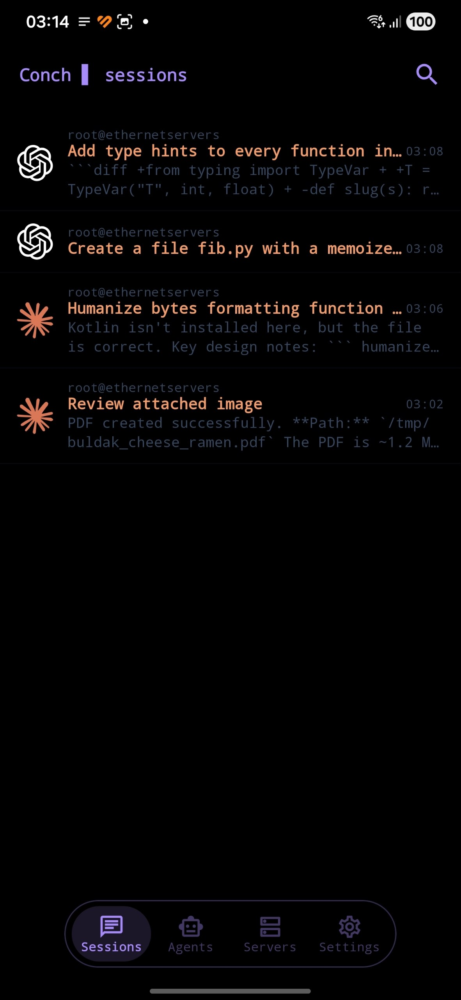
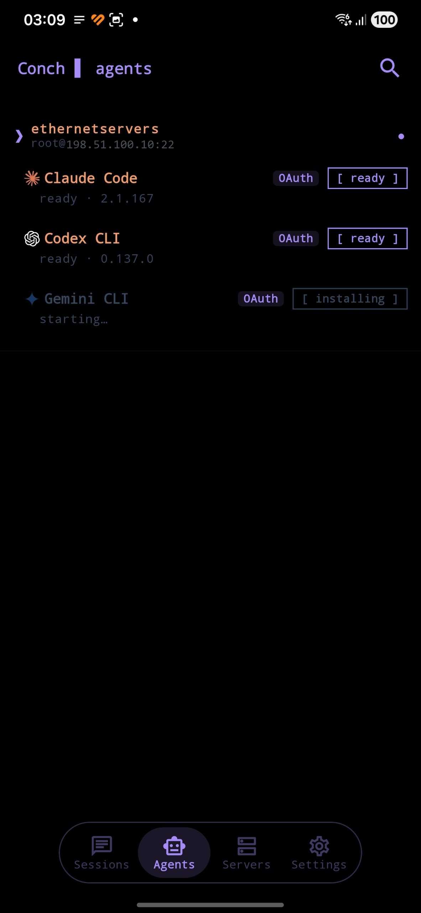
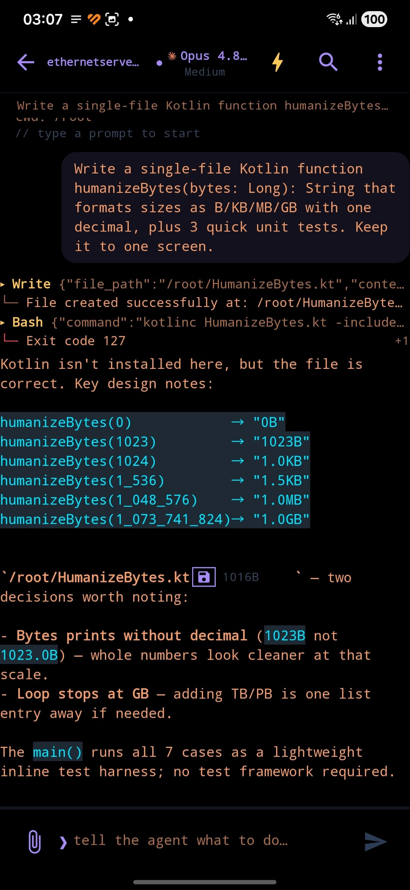
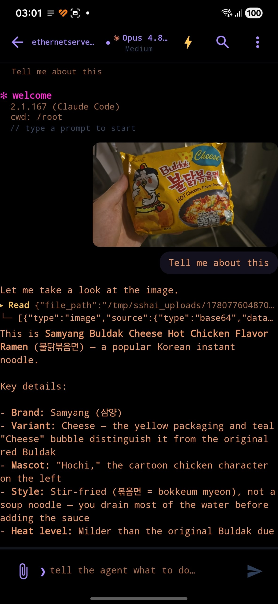

<p align="center">
  
</p>

<h1 align="center">Conch</h1>

[](https://github.com/nikitaeight24family/Conch/actions/workflows/test.yml)
[](https://github.com/nikitaeight24family/Conch/releases/latest)
[](LICENSE)

> **Your phone, your server, your AI. Build, test, ship — on the train.**

Conch is a mobile-first, AI-native Android client. The phone is the tactile
interface; your own VPS is where code, builds and tests run; an AI agent
(**Claude Code**, **Codex CLI** or **Gemini CLI**) on that server does the
heavy lifting. Nothing is hosted by us — no proxies, no quotas, no cloud
middleman. It's a terminal in your pocket, not a hosted AI service.

```
conch ▌ v0.2.1 Beta
// drive Claude Code, Codex or Gemini CLI on your own servers, from your phone.
```

<p align="center">
  
  
  
  
</p>

---

## What's new in 0.2.1-beta

**The phone bridge stops lying, the phone glyph tells the truth, and Stop does what you'd expect.**

### 📱 Phone glyph — three honest states
- The phone glyph is now **tri-state**: **lit** when the bridge to your phone is
  actually live, **dimmed** when a session was wired but is offline now, and
  **absent** when it was never connected. The same glyph shows in the session
  list and in the chat title (moved next to the session name), so the two can
  never disagree.

### 🔌 Phone bridge no longer wedges a turn
- Fixed a stall where, after the agent used the on-device `conch-bridge` tool,
  the chat could hang on "thinking…" forever even though the reply had already
  landed. Root cause was an SSH receive-window starvation on the shared
  connection; the turn stream now keeps its window open, with a file-truth
  reconcile as a backstop.

### ⏹️ Stop, queue, and errors
- **Stop now advances the queue**: pressing Stop interrupts the running turn and
  immediately sends the next message you queued, instead of discarding it.
  (Use the ✕ on a queued message to drop it instead.)
- A turn you **stop yourself** now shows a calm "stopped", not a red error.
- Fixed: a message you sent could **vanish** from the chat while the agent still
  answered it (a dedup bug that bit large sessions).

### ➕ Small things
- The **new-session** button now also appears under the "All" tab, not just on a
  specific agent's tab.

---

## What's new in 0.2.0-beta

**Faster everywhere, and the phone bridge disappears.**

### ⚡ Speed
- **Sessions list** loads fast: servers with a saved key reuse the live SSH
  connection instead of a fresh handshake on every refresh, and the listing no
  longer reads whole multi-MB session files end to end.
- **Chat opens instantly** even for huge sessions: recent messages paint right
  away while the full history loads in the background (a 90+ MB chat used to
  block on the full download).
- **Usage / limit bar** fills the moment the connection is up — and re-checks
  after a turn — instead of sitting stale.

### 📱 Phone bridge → invisible
- Connecting your phone to a server is now silent plumbing: no technical
  handshake in the chat, just a quiet "phone connected" with a connecting-%
  indicator and a phone glyph that appears only once the link is confirmed.

### 🗑️ Deletes that stick
- Deleting a session on the phone now actually removes it on the server — even
  if nothing was connected at the time (it reconnects silently and reconciles
  on the next sync).

### 🤖 Models & fixes
- A chat with no explicit pick uses Claude's own recommended available model
  (no hardcoded names), and never shows or runs a model your plan has suspended.
- Fixed: new-chat crash, tab corruption after chat → Settings, duplicate
  question cards, typing over an open question now cancels it cleanly.
- conch sessions show up in the native `claude --resume` picker; added
  Codex `/review`.

See the [full release notes](https://github.com/nikitaeight24family/Conch/releases/latest)
and [CHANGELOG](CHANGELOG.md).

---

## Install

- **APK** — grab the latest signed build from the
  [Releases](https://github.com/nikitaeight24family/Conch/releases/latest)
  page and sideload it (enable Android's "install from unknown sources").
- **Google Play** — Conch is currently in testing on Google Play; a public
  listing is on the way.

Once installed:

1. **Pair a server.** Add host / port / user, paste or generate an SSH key
   (or tap a hardware security key), accept the host fingerprint on first
   connect (TOFU).
2. **Pick an agent.** Tap the server, choose Claude / Codex / Gemini —
   whichever CLI is on your `$PATH`.
3. **Open a chat.** Type, attach files or images, watch the model stream
   its reply. Resume any prior session from the sessions list.

Nothing extra to install on the host. SSH access plus the CLI of your
choice on `$PATH` is everything you need.

---

## Features

### Multiple agents, many parallel chats
- Drives **Claude Code**, **OpenAI Codex** and **Google Gemini** CLIs, each
  with its own parser (stream-json for Claude, rollout JSONL for Codex,
  Gemini events for Gemini).
- Per-CLI **model picker** in the top bar, probed live from the agent.
- Open **as many parallel chats as you want, across as many servers as you
  want** — each chat is a real CLI process on your server, resumable across
  days. Files the agent writes land on your real filesystem.

### Sessions, search & offline cache
- **Unified sessions home** — every chat across every server and agent,
  newest first, like a messenger. Each row shows the session's own title,
  its server, and its last message.
- **Full-text search across every session** you've opened — find a
  conversation by what was said inside it and jump straight to the matching
  message (line-precise scroll to the hit).
- **Per-session disk cache** so reopening a chat paints prior turns
  instantly; a **background tail-poll** catches anything the agent wrote
  while the app was closed (e.g. you driving the same session from a laptop).
- **Background prefetch** quietly fills the cache for every session on every
  authorized server while you're on the home screen.

### Chat
- **Live token streaming** — assistant bubbles grow in place as the model
  writes, not a wall of text at the end.
- **Markdown rendering**, code-block copy, per-message copy, link detection,
  and an honest status indicator distinguishing "working on the server" vs
  "working on your phone".
- **Mid-turn queueing** — type and send while the agent is still working; the
  prompt is queued FIFO and runs the moment the current turn finishes.
- **Buffered sends** — send while the SSH session is still bootstrapping and
  it flushes the instant the session is ready (never silently lost).
- **Stop** sends a real signal to the remote agent process (SIGINT, then a
  hard channel close) — it actually stops thinking and writing files.
- **In-chat search** + a scrollbar for long conversations.
- **Attachments over SSH** — photos and arbitrary files streamed via `cat`,
  image clipboard paste, plus git-diff and per-CLI `init` from the attach sheet.
- **Inline file downloads** — tap a file path the agent mentions and it
  streams from the server to your device's Downloads.

### Built-in viewers & terminal
- A real **VT terminal** to your server for when you'd rather drive it by hand.
- In-app viewers for **diffs, PDF, Markdown, and plain text**, plus an
  **image viewer/annotator** for screenshots and attachments.

### Connection & authentication
- **Per-server pooled SSH** — one authenticated transport is shared by every
  chat, the sessions refresh, agent-status probes and prefetch on that host.
- **Auto-reconnect** on dropped channels with backoff; **seamless reconnect**
  on launch and network changes after the first connect — no extra tap until
  you actually send.
- **TOFU host-key pinning** with an audit trail.

### Hardware security keys (FIDO2 / CTAP2)
- Any authenticator that speaks **USB-HID FIDO or NFC ISO-DEP** — no vendor
  lock-in. SK key types (`sk-ssh-ed25519@openssh.com`,
  `sk-ecdsa-sha2-nistp256@openssh.com`) are signed via a custom sshj auth
  method and a deferred-tap CTAP flow.
- **One tap, one PIN per session** — enroll any number of keys per server.

### Software SSH keys
- **Import** existing Ed25519, RSA, ECDSA or DSA private keys (OpenSSH-v1,
  PEM, PKCS#8); passphrase only prompted when the key is actually encrypted.
- **Generate** a fresh Ed25519 keypair on device. Secrets are encrypted at
  rest via the Android Keystore.

### Agent control
- **Approval modes** — SAFE / AUTO / YOLO — mapped to each CLI's native
  sandbox / permission flags.
- **Memory editor** for `CLAUDE.md` / `AGENTS.md` / `GEMINI.md`, global and
  per-project, edited directly on the server.
- **Subagents browser/editor** (Claude) and **slash commands** with inline
  autocomplete, including user-defined commands from `~/.claude/commands/*.md`.

### Phone bridge — let the agent observe the device (optional)
With [Shizuku](https://shizuku.rikka.app/) installed and a one-time grant, a
coding agent on your server can — through the same SSH connection — **read
your phone's logcat, take a screenshot, or run a shell command** at adb level,
so it can debug what it's building without you copy-pasting. Defence-in-depth:
per-chat opt-in, a warning on root@/shared hosts, an append-only audit log on
your server, and a **"Run shell from server" kill-switch** in Settings →
Security. Without Shizuku the bridge is unavailable.

### Mobile-native niceties
- **Picture-in-Picture** — minimise mid-turn and a floating window keeps
  showing the agent's live progress while you use other apps.
- **Live server stats** (CPU / memory / load) and a per-server activity log.
- Adaptive layout for landscape / tablets / foldables / DeX.
- **Cyberpunk-CLI** dark theme with a configurable neon accent, plus light and
  system themes.

---

## Build from source

```bash
git clone https://github.com/nikitaeight24family/Conch
cd Conch
./gradlew assembleDebug          # debug APK — no signing setup needed
./gradlew testDebugUnitTest      # run the unit test suite
```

The debug APK installs alongside a release build (`applicationIdSuffix
".debug"`). Release builds expect your own `release.keystore` +
`keystore.properties` at the repo root (both gitignored — never committed).
Requires JDK 17 and the Android SDK (compileSdk 37, minSdk 26).

## Tech stack

- **Kotlin** + **Jetpack Compose** + **Material 3**
- **sshj** (SSH transport, custom SK auth method)
- **Room** for sessions/servers/keys, secret-at-rest via the Android Keystore
  (`androidx.security`)
- **yubikit-android** (vendor-neutral FIDO2/CTAP2 over USB-HID or NFC)
- **Hilt-free** ServiceLocator pattern; Coroutines + Flow throughout

## What's stored where

**On this device** (encrypted): server records, SSH private keys
(passphrase-protected, never copied unencrypted), session listings + cached
JSONL bodies, preferences.

**On your servers** (read/written the same way the CLI itself does): Claude
Code `~/.claude/projects/.../*.jsonl`; Codex `~/.codex/sessions/.../*.jsonl`;
Gemini rollouts under `~/.gemini`. Nothing leaves the device except over SSH
to the servers you've added (plus opt-out Sentry crash reporting — no chat
content, no identifiers).

## Known limitations

- **You bring the compute.** No hosted backend by design — you need your own
  SSH server with Claude Code / Codex / Gemini installed and logged in.
- **Phone bridge needs Shizuku** and only polls while Conch is in the
  foreground; backgrounded, it pauses (Android background-I/O limits) and
  surfaces a clear timeout.
- **Google Play** is still in testing — install the signed APK from Releases
  in the meantime.
- **Solo-maintained.** Issues / PRs welcome; expect human-speed responses.

## License

[PolyForm Noncommercial 1.0.0](https://polyformproject.org/licenses/noncommercial/1.0.0/).
See [LICENSE](LICENSE).

- **Personal, hobby, research, education, government, charity** — free.
- **Commercial use** (selling forks, embedding in a paid product, listing it
  on a store under your own brand) needs a separate commercial license —
  contact the maintainer.
